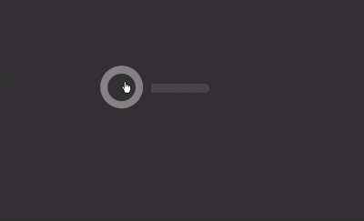

# 🎚️ Animated Toggle Switch

This project showcases a **pure HTML and CSS animated toggle switch**, with a smooth sliding effect and responsive design. No JavaScript required!

https://user-images.githubusercontent.com/your-id/demo-preview.mp4

## 🚀 Features

- ✅ Animated sliding thumb
- 🎨 Custom styling with dark background
- 🧼 Clean CSS transitions
- 💡 Uses only HTML + CSS
- 📱 Responsive using `vmin` units

## 🛠️ How It Works

- The toggle is built using a hidden checkbox input.
- A `<label>` linked to the input acts as the visual switch.
- A `.thumb` inside the label moves when toggled.
- CSS `:checked` selector and keyframes animate the motion.

## 📸 Preview

 
## ✨ Inspiration

This toggle is inspired by modern UI switch designs found in mobile apps and dashboards.

## 📄 License

MIT – feel free to use and modify.

